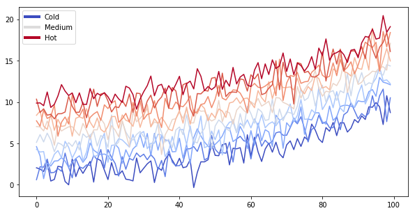

# Content with notebooks

You can also create content with Jupyter Notebooks. The content for the current page is contained
in a Jupyter Notebook in the `notebooks/` folder of the repository. This means that we can include
code blocks and their outputs, and export them to Jekyll markdown.

As it is markdown, you can embed images, HTML, etc into your posts!


## Code blocks and image outputs

For example, here's some sample Matplotlib code:


{:.input_area}
```python
# sphinx_gallery_thumbnail_number = 2
from matplotlib import rcParams, cycler
import matplotlib.pyplot as plt
import numpy as np
plt.ion()

# Fixing random state for reproducibility
np.random.seed(19680801)

N = 10
data = [np.logspace(0, 1, 100) + np.random.randn(100) + ii for ii in range(N)]
data = np.array(data).T
cmap = plt.cm.coolwarm
rcParams['axes.prop_cycle'] = cycler(color=cmap(np.linspace(0, 1, N)))


from matplotlib.lines import Line2D
custom_lines = [Line2D([0], [0], color=cmap(0.), lw=4),
                Line2D([0], [0], color=cmap(.5), lw=4),
                Line2D([0], [0], color=cmap(1.), lw=4)]

fig, ax = plt.subplots(figsize=(10, 5))
lines = ax.plot(data)
ax.legend(custom_lines, ['Cold', 'Medium', 'Hot'])
```


{:.output_data_text}
```
<matplotlib.legend.Legend at 0x7fdd938ee320>
```





Note that the image above is captured and displayed by Jekyll.

## Interactive outputs

We can even do the same for *interactive* material. Below we'll display a map using `ipyleaflet`. When the notebook
is converted to Markdown, the code for creating the interactive map is retained.


{:.input_area}
```python
import folium
```


{:.input_area}
```python
m = folium.Map(
    location=[45.372, -121.6972],
    zoom_start=12,
    tiles='Stamen Terrain'
)

folium.Marker(
    location=[45.3288, -121.6625],
    popup='Mt. Hood Meadows',
    icon=folium.Icon(icon='cloud')
).add_to(m)

folium.Marker(
    location=[45.3311, -121.7113],
    popup='Timberline Lodge',
    icon=folium.Icon(color='green')
).add_to(m)

folium.Marker(
    location=[45.3300, -121.6823],
    popup='Some Other Location',
    icon=folium.Icon(color='red', icon='info-sign')
).add_to(m)


m

```


<div markdown="0">
<div style="width:100%;"><div style="position:relative;width:100%;height:0;padding-bottom:60%;"><iframe src="data:text/html;base64,CiAgICAgICAgPCFET0NUWVBFIGh0bWw+CiAgICAgICAgPGhlYWQ+CiAgICAgICAgICAgIAogICAgICAgIAogICAgICAgICAgICA8bWV0YSBodHRwLWVxdWl2PSJjb250ZW50LXR5cGUiIGNvbnRlbnQ9InRleHQvaHRtbDsgY2hhcnNldD1VVEYtOCIgLz4KICAgICAgICAKICAgICAgICAgICAgCiAgICAgICAgCiAgICAgICAgICAgIDxzY3JpcHQgc3JjPSJodHRwczovL2NkbmpzLmNsb3VkZmxhcmUuY29tL2FqYXgvbGlicy9sZWFmbGV0LzAuNy4zL2xlYWZsZXQuanMiPjwvc2NyaXB0PgogICAgICAgIAogICAgICAgIAogICAgICAgIAogICAgICAgICAgICAKICAgICAgICAKICAgICAgICAgICAgPHNjcmlwdCBzcmM9Imh0dHBzOi8vYWpheC5nb29nbGVhcGlzLmNvbS9hamF4L2xpYnMvanF1ZXJ5LzEuMTEuMS9qcXVlcnkubWluLmpzIj48L3NjcmlwdD4KICAgICAgICAKICAgICAgICAKICAgICAgICAKICAgICAgICAgICAgCiAgICAgICAgCiAgICAgICAgICAgIDxzY3JpcHQgc3JjPSJodHRwczovL21heGNkbi5ib290c3RyYXBjZG4uY29tL2Jvb3RzdHJhcC8zLjIuMC9qcy9ib290c3RyYXAubWluLmpzIj48L3NjcmlwdD4KICAgICAgICAKICAgICAgICAKICAgICAgICAKICAgICAgICAgICAgCiAgICAgICAgCiAgICAgICAgICAgIDxzY3JpcHQgc3JjPSJodHRwczovL2NkbmpzLmNsb3VkZmxhcmUuY29tL2FqYXgvbGlicy9MZWFmbGV0LmF3ZXNvbWUtbWFya2Vycy8yLjAuMi9sZWFmbGV0LmF3ZXNvbWUtbWFya2Vycy5taW4uanMiPjwvc2NyaXB0PgogICAgICAgIAogICAgICAgIAogICAgICAgIAogICAgICAgICAgICAKICAgICAgICAKICAgICAgICAgICAgPHNjcmlwdCBzcmM9Imh0dHBzOi8vY2RuanMuY2xvdWRmbGFyZS5jb20vYWpheC9saWJzL2xlYWZsZXQubWFya2VyY2x1c3Rlci8wLjQuMC9sZWFmbGV0Lm1hcmtlcmNsdXN0ZXItc3JjLmpzIj48L3NjcmlwdD4KICAgICAgICAKICAgICAgICAKICAgICAgICAKICAgICAgICAgICAgCiAgICAgICAgCiAgICAgICAgICAgIDxzY3JpcHQgc3JjPSJodHRwczovL2NkbmpzLmNsb3VkZmxhcmUuY29tL2FqYXgvbGlicy9sZWFmbGV0Lm1hcmtlcmNsdXN0ZXIvMC40LjAvbGVhZmxldC5tYXJrZXJjbHVzdGVyLmpzIj48L3NjcmlwdD4KICAgICAgICAKICAgICAgICAKICAgICAgICAKICAgICAgICAgICAgCiAgICAgICAgCiAgICAgICAgICAgIDxsaW5rIHJlbD0ic3R5bGVzaGVldCIgaHJlZj0iaHR0cHM6Ly9jZG5qcy5jbG91ZGZsYXJlLmNvbS9hamF4L2xpYnMvbGVhZmxldC8wLjcuMy9sZWFmbGV0LmNzcyIgLz4KICAgICAgICAKICAgICAgICAKICAgICAgICAKICAgICAgICAgICAgCiAgICAgICAgCiAgICAgICAgICAgIDxsaW5rIHJlbD0ic3R5bGVzaGVldCIgaHJlZj0iaHR0cHM6Ly9tYXhjZG4uYm9vdHN0cmFwY2RuLmNvbS9ib290c3RyYXAvMy4yLjAvY3NzL2Jvb3RzdHJhcC5taW4uY3NzIiAvPgogICAgICAgIAogICAgICAgIAogICAgICAgIAogICAgICAgICAgICAKICAgICAgICAKICAgICAgICAgICAgPGxpbmsgcmVsPSJzdHlsZXNoZWV0IiBocmVmPSJodHRwczovL21heGNkbi5ib290c3RyYXBjZG4uY29tL2Jvb3RzdHJhcC8zLjIuMC9jc3MvYm9vdHN0cmFwLXRoZW1lLm1pbi5jc3MiIC8+CiAgICAgICAgCiAgICAgICAgCiAgICAgICAgCiAgICAgICAgICAgIAogICAgICAgIAogICAgICAgICAgICA8bGluayByZWw9InN0eWxlc2hlZXQiIGhyZWY9Imh0dHBzOi8vbWF4Y2RuLmJvb3RzdHJhcGNkbi5jb20vZm9udC1hd2Vzb21lLzQuMS4wL2Nzcy9mb250LWF3ZXNvbWUubWluLmNzcyIgLz4KICAgICAgICAKICAgICAgICAKICAgICAgICAKICAgICAgICAgICAgCiAgICAgICAgCiAgICAgICAgICAgIDxsaW5rIHJlbD0ic3R5bGVzaGVldCIgaHJlZj0iaHR0cHM6Ly9jZG5qcy5jbG91ZGZsYXJlLmNvbS9hamF4L2xpYnMvTGVhZmxldC5hd2Vzb21lLW1hcmtlcnMvMi4wLjIvbGVhZmxldC5hd2Vzb21lLW1hcmtlcnMuY3NzIiAvPgogICAgICAgIAogICAgICAgIAogICAgICAgIAogICAgICAgICAgICAKICAgICAgICAKICAgICAgICAgICAgPGxpbmsgcmVsPSJzdHlsZXNoZWV0IiBocmVmPSJodHRwczovL2NkbmpzLmNsb3VkZmxhcmUuY29tL2FqYXgvbGlicy9sZWFmbGV0Lm1hcmtlcmNsdXN0ZXIvMC40LjAvTWFya2VyQ2x1c3Rlci5EZWZhdWx0LmNzcyIgLz4KICAgICAgICAKICAgICAgICAKICAgICAgICAKICAgICAgICAgICAgCiAgICAgICAgCiAgICAgICAgICAgIDxsaW5rIHJlbD0ic3R5bGVzaGVldCIgaHJlZj0iaHR0cHM6Ly9jZG5qcy5jbG91ZGZsYXJlLmNvbS9hamF4L2xpYnMvbGVhZmxldC5tYXJrZXJjbHVzdGVyLzAuNC4wL01hcmtlckNsdXN0ZXIuY3NzIiAvPgogICAgICAgIAogICAgICAgIAogICAgICAgIAogICAgICAgICAgICAKICAgICAgICAKICAgICAgICAgICAgPGxpbmsgcmVsPSJzdHlsZXNoZWV0IiBocmVmPSJodHRwczovL3Jhdy5naXRodWJ1c2VyY29udGVudC5jb20vcHl0aG9uLXZpc3VhbGl6YXRpb24vZm9saXVtL21hc3Rlci9mb2xpdW0vdGVtcGxhdGVzL2xlYWZsZXQuYXdlc29tZS5yb3RhdGUuY3NzIiAvPgogICAgICAgIAogICAgICAgIAogICAgICAgIAogICAgICAgICAgICAKICAgICAgICAgICAgPHN0eWxlPgoKICAgICAgICAgICAgaHRtbCwgYm9keSB7CiAgICAgICAgICAgICAgICB3aWR0aDogMTAwJTsKICAgICAgICAgICAgICAgIGhlaWdodDogMTAwJTsKICAgICAgICAgICAgICAgIG1hcmdpbjogMDsKICAgICAgICAgICAgICAgIHBhZGRpbmc6IDA7CiAgICAgICAgICAgICAgICB9CgogICAgICAgICAgICAjbWFwIHsKICAgICAgICAgICAgICAgIHBvc2l0aW9uOmFic29sdXRlOwogICAgICAgICAgICAgICAgdG9wOjA7CiAgICAgICAgICAgICAgICBib3R0b206MDsKICAgICAgICAgICAgICAgIHJpZ2h0OjA7CiAgICAgICAgICAgICAgICBsZWZ0OjA7CiAgICAgICAgICAgICAgICB9CiAgICAgICAgICAgIDwvc3R5bGU+CiAgICAgICAgICAgIAogICAgICAgIAogICAgICAgICAgICAKICAgICAgICAgICAgPHN0eWxlPiAjbWFwX2MwZDY2ZGYxNjlmNzQ4M2Q4NjFhYmFhMzA0M2I2ZTdlIHsKICAgICAgICAgICAgICAgIHBvc2l0aW9uIDogcmVsYXRpdmU7CiAgICAgICAgICAgICAgICB3aWR0aCA6IDEwMC4wJTsKICAgICAgICAgICAgICAgIGhlaWdodDogMTAwLjAlOwogICAgICAgICAgICAgICAgbGVmdDogMC4wJTsKICAgICAgICAgICAgICAgIHRvcDogMC4wJTsKICAgICAgICAgICAgICAgIH0KICAgICAgICAgICAgPC9zdHlsZT4KICAgICAgICAKICAgICAgICAKICAgICAgICAKICAgICAgICA8L2hlYWQ+CiAgICAgICAgPGJvZHk+CiAgICAgICAgICAgIAogICAgICAgIAogICAgICAgICAgICAKICAgICAgICAgICAgPGRpdiBjbGFzcz0iZm9saXVtLW1hcCIgaWQ9Im1hcF9jMGQ2NmRmMTY5Zjc0ODNkODYxYWJhYTMwNDNiNmU3ZSIgPjwvZGl2PgogICAgICAgIAogICAgICAgIAogICAgICAgIAogICAgICAgIDwvYm9keT4KICAgICAgICA8c2NyaXB0PgogICAgICAgICAgICAKICAgICAgICAKICAgICAgICAgICAgCgogICAgICAgICAgICB2YXIgc291dGhXZXN0ID0gTC5sYXRMbmcoLTkwLCAtMTgwKTsKICAgICAgICAgICAgdmFyIG5vcnRoRWFzdCA9IEwubGF0TG5nKDkwLCAxODApOwogICAgICAgICAgICB2YXIgYm91bmRzID0gTC5sYXRMbmdCb3VuZHMoc291dGhXZXN0LCBub3J0aEVhc3QpOwoKICAgICAgICAgICAgdmFyIG1hcF9jMGQ2NmRmMTY5Zjc0ODNkODYxYWJhYTMwNDNiNmU3ZSA9IEwubWFwKCdtYXBfYzBkNjZkZjE2OWY3NDgzZDg2MWFiYWEzMDQzYjZlN2UnLCB7CiAgICAgICAgICAgICAgICAgICAgICAgICAgICAgICAgICAgICAgICAgICBjZW50ZXI6WzQ1LjM3MiwtMTIxLjY5NzJdLAogICAgICAgICAgICAgICAgICAgICAgICAgICAgICAgICAgICAgICAgICAgem9vbTogMTIsCiAgICAgICAgICAgICAgICAgICAgICAgICAgICAgICAgICAgICAgICAgICBtYXhCb3VuZHM6IGJvdW5kcywKICAgICAgICAgICAgICAgICAgICAgICAgICAgICAgICAgICAgICAgICAgIGxheWVyczogW10sCiAgICAgICAgICAgICAgICAgICAgICAgICAgICAgICAgICAgICAgICAgICBjcnM6IEwuQ1JTLkVQU0czODU3CiAgICAgICAgICAgICAgICAgICAgICAgICAgICAgICAgICAgICAgICAgfSk7CiAgICAgICAgICAgIAogICAgICAgIAogICAgICAgIAogICAgICAgICAgICAKICAgICAgICAgICAgdmFyIHRpbGVfbGF5ZXJfYzI1ZDdiN2UwMmM2NGUxMzkzOTkzYzIzOGQzM2EwYmEgPSBMLnRpbGVMYXllcigKICAgICAgICAgICAgICAgICdodHRwczovL3N0YW1lbi10aWxlcy17c30uYS5zc2wuZmFzdGx5Lm5ldC90ZXJyYWluL3t6fS97eH0ve3l9LmpwZycsCiAgICAgICAgICAgICAgICB7CiAgICAgICAgICAgICAgICAgICAgbWF4Wm9vbTogMTgsCiAgICAgICAgICAgICAgICAgICAgbWluWm9vbTogMSwKICAgICAgICAgICAgICAgICAgICBhdHRyaWJ1dGlvbjogJ01hcCB0aWxlcyBieSA8YSBocmVmPSJodHRwOi8vc3RhbWVuLmNvbSI+U3RhbWVuIERlc2lnbjwvYT4sIHVuZGVyIDxhIGhyZWY9Imh0dHA6Ly9jcmVhdGl2ZWNvbW1vbnMub3JnL2xpY2Vuc2VzL2J5LzMuMCI+Q0MgQlkgMy4wPC9hPi4gRGF0YSBieSA8YSBocmVmPSJodHRwOi8vb3BlbnN0cmVldG1hcC5vcmciPk9wZW5TdHJlZXRNYXA8L2E+LCB1bmRlciA8YSBocmVmPSJodHRwOi8vY3JlYXRpdmVjb21tb25zLm9yZy9saWNlbnNlcy9ieS1zYS8zLjAiPkNDIEJZIFNBPC9hPi4nLAogICAgICAgICAgICAgICAgICAgIGRldGVjdFJldGluYTogZmFsc2UKICAgICAgICAgICAgICAgICAgICB9CiAgICAgICAgICAgICAgICApLmFkZFRvKG1hcF9jMGQ2NmRmMTY5Zjc0ODNkODYxYWJhYTMwNDNiNmU3ZSk7CgogICAgICAgIAogICAgICAgIAogICAgICAgICAgICAKCiAgICAgICAgICAgIHZhciBtYXJrZXJfMTRjOTlkYTk1ZTJmNGMxNWE1MjE3M2IyMzczMTliM2MgPSBMLm1hcmtlcigKICAgICAgICAgICAgICAgIFs0NS4zMjg4LC0xMjEuNjYyNV0sCiAgICAgICAgICAgICAgICB7CiAgICAgICAgICAgICAgICAgICAgaWNvbjogbmV3IEwuSWNvbi5EZWZhdWx0KCkKICAgICAgICAgICAgICAgICAgICB9CiAgICAgICAgICAgICAgICApCiAgICAgICAgICAgICAgICAuYWRkVG8obWFwX2MwZDY2ZGYxNjlmNzQ4M2Q4NjFhYmFhMzA0M2I2ZTdlKTsKICAgICAgICAgICAgCiAgICAgICAgCiAgICAgICAgICAgIAoKICAgICAgICAgICAgICAgIHZhciBpY29uXzE1MzRmMTllMjZiNzRkZDA5ZmU5OWNkNTY0NzE5ZDIzID0gTC5Bd2Vzb21lTWFya2Vycy5pY29uKHsKICAgICAgICAgICAgICAgICAgICBpY29uOiAnY2xvdWQnLAogICAgICAgICAgICAgICAgICAgIGljb25Db2xvcjogJ3doaXRlJywKICAgICAgICAgICAgICAgICAgICBtYXJrZXJDb2xvcjogJ2JsdWUnLAogICAgICAgICAgICAgICAgICAgIHByZWZpeDogJ2dseXBoaWNvbicsCiAgICAgICAgICAgICAgICAgICAgZXh0cmFDbGFzc2VzOiAnZmEtcm90YXRlLTAnCiAgICAgICAgICAgICAgICAgICAgfSk7CiAgICAgICAgICAgICAgICBtYXJrZXJfMTRjOTlkYTk1ZTJmNGMxNWE1MjE3M2IyMzczMTliM2Muc2V0SWNvbihpY29uXzE1MzRmMTllMjZiNzRkZDA5ZmU5OWNkNTY0NzE5ZDIzKTsKICAgICAgICAgICAgCiAgICAgICAgCiAgICAgICAgICAgIAogICAgICAgICAgICB2YXIgcG9wdXBfZDFhYTlmZWZjNjQ2NDhmMzgxMDBhMjlkYjRiNDNhMjggPSBMLnBvcHVwKHttYXhXaWR0aDogJzMwMCd9KTsKCiAgICAgICAgICAgIAogICAgICAgICAgICAgICAgdmFyIGh0bWxfYzY4OTgyMzdmOWYxNDNkMDk0ZjhiNWQ2NWViMDQ2ZTYgPSAkKCcgICAgICAgICA8ZGl2IGlkPSJodG1sX2M2ODk4MjM3ZjlmMTQzZDA5NGY4YjVkNjVlYjA0NmU2IiAgICAgICAgICAgICAgICAgc3R5bGU9IndpZHRoOiAxMDAuMCU7IGhlaWdodDogMTAwLjAlOyI+ICAgICAgICAgICAgICAgICBNdC4gSG9vZCBNZWFkb3dzPC9kaXY+ICAgICAgICAgICAgICAgICAnKVswXTsKICAgICAgICAgICAgICAgIHBvcHVwX2QxYWE5ZmVmYzY0NjQ4ZjM4MTAwYTI5ZGI0YjQzYTI4LnNldENvbnRlbnQoaHRtbF9jNjg5ODIzN2Y5ZjE0M2QwOTRmOGI1ZDY1ZWIwNDZlNik7CiAgICAgICAgICAgIAoKICAgICAgICAgICAgbWFya2VyXzE0Yzk5ZGE5NWUyZjRjMTVhNTIxNzNiMjM3MzE5YjNjLmJpbmRQb3B1cChwb3B1cF9kMWFhOWZlZmM2NDY0OGYzODEwMGEyOWRiNGI0M2EyOCk7CgogICAgICAgICAgICAKICAgICAgICAKICAgICAgICAKICAgICAgICAgICAgCgogICAgICAgICAgICB2YXIgbWFya2VyXzk0NmNiNTM5MWUzNTQ5ZGRhMThhODlmYWE4MDg1ZTg4ID0gTC5tYXJrZXIoCiAgICAgICAgICAgICAgICBbNDUuMzMxMSwtMTIxLjcxMTNdLAogICAgICAgICAgICAgICAgewogICAgICAgICAgICAgICAgICAgIGljb246IG5ldyBMLkljb24uRGVmYXVsdCgpCiAgICAgICAgICAgICAgICAgICAgfQogICAgICAgICAgICAgICAgKQogICAgICAgICAgICAgICAgLmFkZFRvKG1hcF9jMGQ2NmRmMTY5Zjc0ODNkODYxYWJhYTMwNDNiNmU3ZSk7CiAgICAgICAgICAgIAogICAgICAgIAogICAgICAgICAgICAKCiAgICAgICAgICAgICAgICB2YXIgaWNvbl85NWUxMTBkNmJhOTI0ZTE2YmE1ZGM1YWVhOGY4MGRiZiA9IEwuQXdlc29tZU1hcmtlcnMuaWNvbih7CiAgICAgICAgICAgICAgICAgICAgaWNvbjogJ2luZm8tc2lnbicsCiAgICAgICAgICAgICAgICAgICAgaWNvbkNvbG9yOiAnd2hpdGUnLAogICAgICAgICAgICAgICAgICAgIG1hcmtlckNvbG9yOiAnZ3JlZW4nLAogICAgICAgICAgICAgICAgICAgIHByZWZpeDogJ2dseXBoaWNvbicsCiAgICAgICAgICAgICAgICAgICAgZXh0cmFDbGFzc2VzOiAnZmEtcm90YXRlLTAnCiAgICAgICAgICAgICAgICAgICAgfSk7CiAgICAgICAgICAgICAgICBtYXJrZXJfOTQ2Y2I1MzkxZTM1NDlkZGExOGE4OWZhYTgwODVlODguc2V0SWNvbihpY29uXzk1ZTExMGQ2YmE5MjRlMTZiYTVkYzVhZWE4ZjgwZGJmKTsKICAgICAgICAgICAgCiAgICAgICAgCiAgICAgICAgICAgIAogICAgICAgICAgICB2YXIgcG9wdXBfZWZmYWQzYThjYzQ2NDhjNmI3MmM3NjI3YjA0MzE4ZmUgPSBMLnBvcHVwKHttYXhXaWR0aDogJzMwMCd9KTsKCiAgICAgICAgICAgIAogICAgICAgICAgICAgICAgdmFyIGh0bWxfMjM5ZjgwZjU4ZGJiNGYxOGI4MDEwMjc3NTk0MWMzYmUgPSAkKCcgICAgICAgICA8ZGl2IGlkPSJodG1sXzIzOWY4MGY1OGRiYjRmMThiODAxMDI3NzU5NDFjM2JlIiAgICAgICAgICAgICAgICAgc3R5bGU9IndpZHRoOiAxMDAuMCU7IGhlaWdodDogMTAwLjAlOyI+ICAgICAgICAgICAgICAgICBUaW1iZXJsaW5lIExvZGdlPC9kaXY+ICAgICAgICAgICAgICAgICAnKVswXTsKICAgICAgICAgICAgICAgIHBvcHVwX2VmZmFkM2E4Y2M0NjQ4YzZiNzJjNzYyN2IwNDMxOGZlLnNldENvbnRlbnQoaHRtbF8yMzlmODBmNThkYmI0ZjE4YjgwMTAyNzc1OTQxYzNiZSk7CiAgICAgICAgICAgIAoKICAgICAgICAgICAgbWFya2VyXzk0NmNiNTM5MWUzNTQ5ZGRhMThhODlmYWE4MDg1ZTg4LmJpbmRQb3B1cChwb3B1cF9lZmZhZDNhOGNjNDY0OGM2YjcyYzc2MjdiMDQzMThmZSk7CgogICAgICAgICAgICAKICAgICAgICAKICAgICAgICAKICAgICAgICAgICAgCgogICAgICAgICAgICB2YXIgbWFya2VyX2RhZjI0YWY5ZTk2MTQ5MzM4N2Y2ZjM1NzJlODlhMWMwID0gTC5tYXJrZXIoCiAgICAgICAgICAgICAgICBbNDUuMzMsLTEyMS42ODIzXSwKICAgICAgICAgICAgICAgIHsKICAgICAgICAgICAgICAgICAgICBpY29uOiBuZXcgTC5JY29uLkRlZmF1bHQoKQogICAgICAgICAgICAgICAgICAgIH0KICAgICAgICAgICAgICAgICkKICAgICAgICAgICAgICAgIC5hZGRUbyhtYXBfYzBkNjZkZjE2OWY3NDgzZDg2MWFiYWEzMDQzYjZlN2UpOwogICAgICAgICAgICAKICAgICAgICAKICAgICAgICAgICAgCgogICAgICAgICAgICAgICAgdmFyIGljb25fMjkxYTFmZjNlZjdmNDdiZjk0ZGI1MzMzYWQ2NjFhYTIgPSBMLkF3ZXNvbWVNYXJrZXJzLmljb24oewogICAgICAgICAgICAgICAgICAgIGljb246ICdpbmZvLXNpZ24nLAogICAgICAgICAgICAgICAgICAgIGljb25Db2xvcjogJ3doaXRlJywKICAgICAgICAgICAgICAgICAgICBtYXJrZXJDb2xvcjogJ3JlZCcsCiAgICAgICAgICAgICAgICAgICAgcHJlZml4OiAnZ2x5cGhpY29uJywKICAgICAgICAgICAgICAgICAgICBleHRyYUNsYXNzZXM6ICdmYS1yb3RhdGUtMCcKICAgICAgICAgICAgICAgICAgICB9KTsKICAgICAgICAgICAgICAgIG1hcmtlcl9kYWYyNGFmOWU5NjE0OTMzODdmNmYzNTcyZTg5YTFjMC5zZXRJY29uKGljb25fMjkxYTFmZjNlZjdmNDdiZjk0ZGI1MzMzYWQ2NjFhYTIpOwogICAgICAgICAgICAKICAgICAgICAKICAgICAgICAgICAgCiAgICAgICAgICAgIHZhciBwb3B1cF9kNjY3ZTY4ZTUyMjE0YjJkYjljOGQ3YmQ2MGVhODBkNyA9IEwucG9wdXAoe21heFdpZHRoOiAnMzAwJ30pOwoKICAgICAgICAgICAgCiAgICAgICAgICAgICAgICB2YXIgaHRtbF9jMDJjMGZmMTY2Nzk0YzhmOGFiNmZkYmI3OGY5MzJjYyA9ICQoJyAgICAgICAgIDxkaXYgaWQ9Imh0bWxfYzAyYzBmZjE2Njc5NGM4ZjhhYjZmZGJiNzhmOTMyY2MiICAgICAgICAgICAgICAgICBzdHlsZT0id2lkdGg6IDEwMC4wJTsgaGVpZ2h0OiAxMDAuMCU7Ij4gICAgICAgICAgICAgICAgIFNvbWUgT3RoZXIgTG9jYXRpb248L2Rpdj4gICAgICAgICAgICAgICAgICcpWzBdOwogICAgICAgICAgICAgICAgcG9wdXBfZDY2N2U2OGU1MjIxNGIyZGI5YzhkN2JkNjBlYTgwZDcuc2V0Q29udGVudChodG1sX2MwMmMwZmYxNjY3OTRjOGY4YWI2ZmRiYjc4ZjkzMmNjKTsKICAgICAgICAgICAgCgogICAgICAgICAgICBtYXJrZXJfZGFmMjRhZjllOTYxNDkzMzg3ZjZmMzU3MmU4OWExYzAuYmluZFBvcHVwKHBvcHVwX2Q2NjdlNjhlNTIyMTRiMmRiOWM4ZDdiZDYwZWE4MGQ3KTsKCiAgICAgICAgICAgIAogICAgICAgIAogICAgICAgIAogICAgICAgIAogICAgICAgIDwvc2NyaXB0PgogICAgICAgIA==" style="position:absolute;width:100%;height:100%;left:0;top:0;"></iframe></div></div>
</div>


## Next steps

The remaining chapters in this textbook are the first few chapters in the textbook used in Data 8, which
also uses TwJJ for its course. Take a look at the content for inspiration and ideas!
