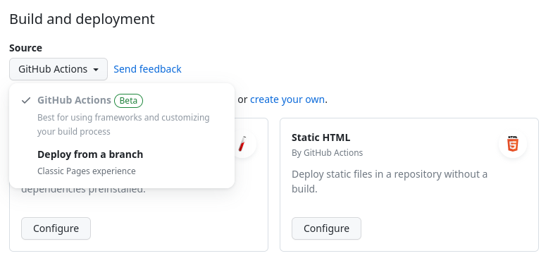

(publish/gh-pages)=
# GitHub Pages and Actions

Once your content is on GitHub, you can easily host it as a [GitHub Pages](https://docs.github.com/en/pages/quickstart) website. This is a service where GitHub hosts your static files as if they were a standalone website. The quickest way to get started with Jupyter Book on GitHub Pages is to use GitHub Actions to deploy the built HTML files.

[GitHub Actions](https://docs.github.com/en/actions) is a tool that allows you to automate things on GitHub.
It is used for a variety of things, such as testing, publishing packages and continuous integration.

Note that if you're not hosting your book on GitHub,
or if you'd like another, user-friendly service to build it automatically,
see the [guide to publishing your book on Netlify](./netlify.md).

```{note}
You should be familiar with GitHub Actions before using them
to automatically host your Jupyter Books.
[See the GitHub Actions documentation](https://help.github.com/en/actions)
for more information.
```

To build your book with GitHub Actions, you'll first need to enable GitHub pages for your project. The GitHub Pages settings for a repository can be found at `Settings` -> `Pages`, where `Source` should be set to `GitHub Actions`.




Next, you'll need to setup a workflow that does the following things:

* Activates when a *push* event happens on `master` (or whichever)
  branch has your latest book content.
* Installs Jupyter Book and any dependencies needed to build
  your book.
* Builds your book's HTML.
* Uses the `actions/deploy-pages` action to upload that HTML to GitHub Pages.

````{margin}
```{note}
Make sure you use Jupyter Book >= `1.0.0`.
To use the latest version, run `pip install -U jupyter-book`.
```
````

:::{tip}
You can use the [Jupyter Book cookiecutter](https://github.com/executablebooks/cookiecutter-jupyter-book) to quickly create a book template that already includes the GitHub Actions workflow file needed to automatically deploy your book to GitHub Pages:

```bash
jupyter-book create --cookiecutter mybookpath/
```

For more help, see the [Jupyter Book cookiecutter GitHub repository](https://github.com/executablebooks/cookiecutter-jupyter-book), or run:

```bash
jupyter-book create --help
```
:::

Here is a simple YAML configuration for a Github Action that will publish a Jupyter Book found _in the root of the GitHub repository_ to GitHub Pages:

```yaml
name: deploy-book

# Run this when the master or main branch changes
on:
  push:
    branches:
    - master
    - main
    # If your git repository has the Jupyter Book within some-subfolder next to
    # unrelated files, you can make this run only if a file within that specific
    # folder has been modified.
    #
    # paths:
    # - some-subfolder/**

# This job installs dependencies, builds the book, and pushes it to `gh-pages`
jobs:
  deploy-book:
    runs-on: ubuntu-latest
    permissions:
      pages: write
      id-token: write
    steps:
    - uses: actions/checkout@v3

    # Install dependencies
    - name: Set up Python 3.11
      uses: actions/setup-python@v4
      with:
        python-version: 3.11

    - name: Install dependencies
      run: |
        pip install -r requirements.txt

    # (optional) Cache your executed notebooks between runs
    # if you have config:
    # execute:
    #   execute_notebooks: cache
    - name: cache executed notebooks
      uses: actions/cache@v3
      with:
        path: _build/.jupyter_cache
        key: jupyter-book-cache-${{ hashFiles('requirements.txt') }}

    # Build the book
    - name: Build the book
      run: |
        jupyter-book build .

    # Upload the book's HTML as an artifact
    - name: Upload artifact
      uses: actions/upload-pages-artifact@v2
      with:
        path: "_build/html"

    # Deploy the book's HTML to GitHub Pages
    - name: Deploy to GitHub Pages
      id: deployment
      uses: actions/deploy-pages@v2
```


For more information on GitHub Pages, such as configuring custom domains, visit the [GitHub Pages documentation](https://docs.github.com/en/pages).
