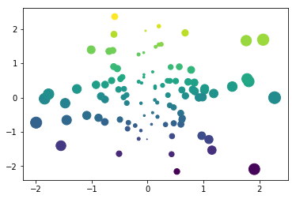

# Hiding code blocks or entire cells

It's possible to control which cells show up in your final book pages. For example,
you may want to display a complex visualization to illustrate an idea, but don't
want the page to be cluttered with a large code cell that generated the viz. In other
cases, you may want to remove a code cell entirely.

This page explains how to accomplish this with Jupyter Book.

## Hiding code cells and displaying a button to show them

Jupyter Books uses **notebook cell tags** to determine which code cells to hide.
If you add the tag `hidecode` to a cell, then Jupyter Book will hide the cell but
display the outputs.

By default, Jupyter Book will display a small button to the right of the 
location that used to hold your code cell. If a user clicks the button, your
code cell will be displayed. For example, see the cell below contains the `hidecode`
tag:


{:.input_area .hidecode}
```python
import numpy as np
import matplotlib.pyplot as plt
plt.ion()

data = np.random.randn(2, 100)
fig, ax = plt.subplots()
ax.scatter(*data, c=data[1], s=100*np.abs(data[0]));
```


{:.output .output_png}



Try clicking the button to the right of the empty spot above!

Note that this button only shows up for cells where you've hidden the code:


{:.input_area}
```python
print("This cell will show up!")
```


{:.output .output_stream}
```
This cell will show up!

```

You can disable this behavior by using the following configuration option:

```yaml
use_hide_code_button      : false 
```

## Hiding the inputs and outputs of a cell

You can also hide **both** the inputs and outputs of a cell, in which case it
won't show up in your book at all. These cells remain in the notebook file itself,
so they'll show up if readers click on a JupyterHub or Binder link from a page.

To hide both the inputs and outputs of a cell, use the following configuration option:

```yaml
hide_cell_text            : "# YOUR SEARCH TEXT"
```

When you build your book, Jupyter Book will search each code cell for the text specified
by `hide_cell_text`. It will remove any cells that contain this text.
