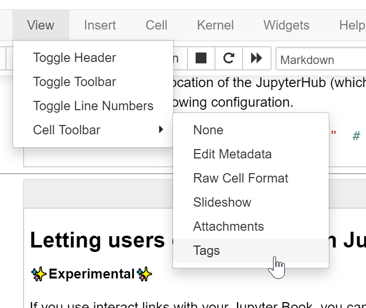
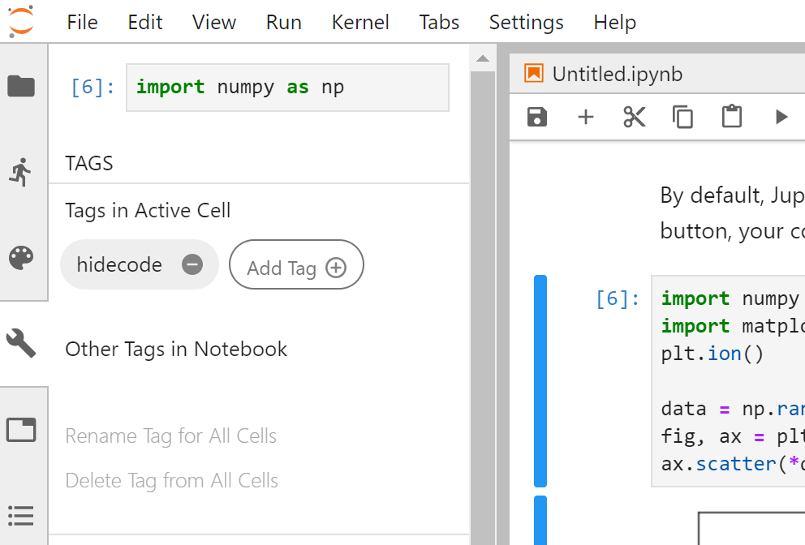

The following are some common issues and questions that have arisen when
building your textbook with Jekyll.

## How can I update my book?

Sometimes Jupyter Book will get updates that you want to incorporate into
a book you've already built. The easiest way to do this is to use the Command-Line Interface to
upgrade your book.

To upgrade a pre-existing Jupyter Book, run the following command:

```bash
jupyter-book upgrade path/to/mybook
```

This will do the following:

1. Generate a fresh Jupyter Book in `mybook_UPGRADED` using the content files in your
   current book.
2. If this succeeds, copy over the contents of `mybook_UPGRADED` into your current book folder.
3. If this succeeds, delete the `mybook_UPGRADED` folder.

Note that only the content that you can manually specify via the `jupyter-book create` command
will be retained in your upgraded book. For a list of these options, see the help menu for this command:

```bash
jupyter-book create -h
```

You should check out the content in your upgraded book to make sure it looks correct, then
commit the changes to your repository.

## Does the book behave differently depending on the browser?

Maybe - Jupyter Book does use some features that might have different behaviors in
some browsers. For example, Safari [tends to treat downloadable objects](https://github.com/jupyter/jupyter-book/pull/104#issuecomment-462461188)
differently for some reason.

The two browsers on which Jupyter Book should always behave as expected are
**Firefox** and **Chrome**.

## Why isn't my math showing up properly?

This site uses MathJax to render all math, with `$` denoting inline math,
and `$$` denoting multi-line math blocks. Make sure that all of your math
is wrapped in these characters.

Another tip is to make sure that your math isn't being escaped improperly.
Jekyll strips escape characters, so you should make sure to add **two**
escape characters when needed. This is done automatically for many escape
characters in `generate_book.py`, and if you notice something that should
be included in this script, please open an issue
[at the textbook template issues page](https://github.com/jupyter/jupyter-book/issues)

## How can I include interactive Plotly figures?

To display interactive [Plotly](https://plot.ly/python/) figures, they must
first be generated in a Jupyter notebook using the [offline mode](https://plot.ly/python/offline/).
You must then plot the figure with `plotly.offline.plot()`, which generates an HTML file (`plotly.offline.iplot()` does not),
and then load the HTML into the notebook with `display(HTML('file.html'))` prior to saving your *.ipynb file.

e.g.

```
from IPython.core.display import display, HTML
from plotly.offline import init_notebook_mode, plot
init_notebook_mode(connected=True)
.
.
.
plot(fig, filename = 'figure.html')
display(HTML('figure.html')
```

Note that, if viewing the file on a Jupyter Notebook session, the figure will not be displayed there (`iplot` is needed for this). However, if working on a [JupyterLab](https://github.com/binder-examples/jupyterlab) session, the figure can be displayed there using the `plot` code above by having the [JupyterLab plotly extension](https://github.com/jupyterlab/jupyter-renderers/tree/master/packages/plotly-extension) installed.

## What if I have an issue or question?

If you've got questions, concerns, or suggestions, please open an issue at
[at the jupyter book issues page](https://github.com/jupyter/jupyter-book/issues)

## How should I add cell tags to my notebooks?

You can control the behavior of Jupyter Book by putting custom tags
in the metadata of your cells. This allows you to do things like
[automatically hide code cells](../features/hiding) as well as
[adding interactive widgets to cells](../features/interactive_cells).

There are two straightforward ways to add metadata to cells:

1. **Use the Jupyter Notebook cell tag editor**. The Jupyter Notebook ships with a
   cell tag editor by default. This lets you add cell tags to each cell quickly.

   To enable the cell tag editor, go click `View -> Cell Toolbar -> Tags`. This
   will enable the tags UI. Here's what the menu looks like.

   

2. **Use the JupyterLab Cell Tags plugin**. JupyterLab is an IDE-like Jupyter
   environment that runs in your browser. It has a rich extension ecosystem.
   A particularly useful extension
   [is the "cell tags" plugin](https://github.com/jupyterlab/jupyterlab-celltags),
   which exposes a user interface that lets you quickly insert cell tags.

   You can install the cell tags plugin with the following command (after installing
   JupyterLab).

   ```
   jupyter labextension install @jupyterlab/celltags
   ```

   Then, you'll find tags under the "wrench" menu section.
   Here's what the tags UI in JupyterLab looks like.

   
